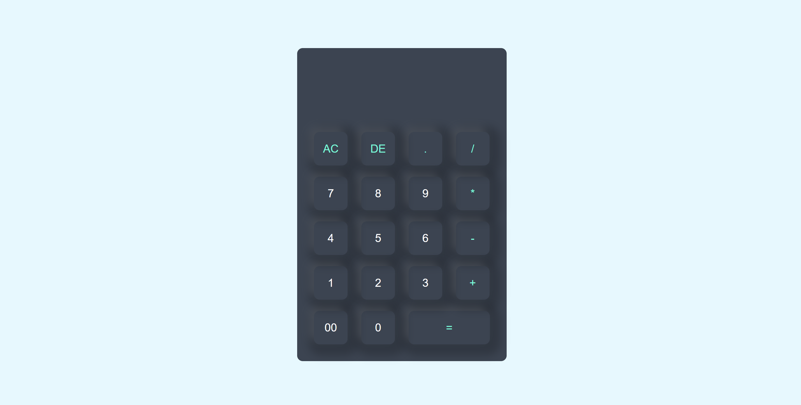

# 🧮 Calculator Project

A simple, responsive **Calculator** built with **HTML** and **CSS**, designed to perform basic arithmetic operations with an elegant and user-friendly interface.

## 📸 Screenshot

### ✨ Calculator UI Example


## 🚀 Features

- ➕ Addition, ➖ Subtraction, ✖️ Multiplication, ➗ Division  
- 🎯 Clean and intuitive user interface  
- 🎨 Fully responsive design for all devices  
- ✅ Pure **HTML** and **CSS** — No JavaScript required (static design)  
- 💻 Ready to use and easily customizable for any web project  

## 🛠️ Tech Stack

- Markup: **HTML5**  
- Styling: **CSS3**  

## 📌 Installation & Setup

### Prerequisites
- 📌 A modern web browser (Chrome, Firefox, Edge, or Safari)  
- 📌 A code editor (like VSCode)  

### Steps
1. 📥 Clone the repository:
   ```bash
   git clone https://github.com/shelavalepallavi/calculator.git

📁 Open the project folder in your code editor.

🌐 Open index.html in your browser to view the calculator design.

🎯 Usage
Copy the calculator HTML structure from index.html.

Include the CSS styles from style.css in your project.

Customize the calculator layout, colors, and fonts according to your preference.

🚀 Deployment
Deploy this project easily on:

GitHub Pages


🙌 Contributing
Pull requests are welcome! If you have creative UI enhancements or additional features, feel free to contribution.
